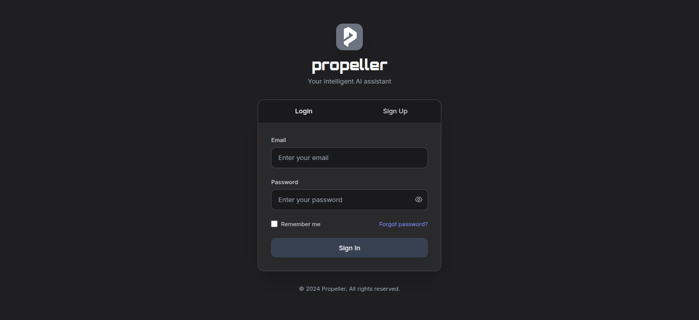
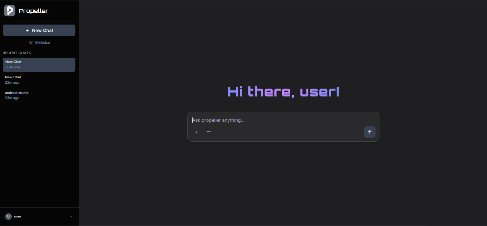
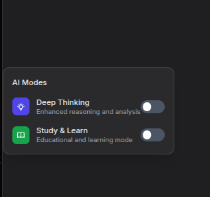
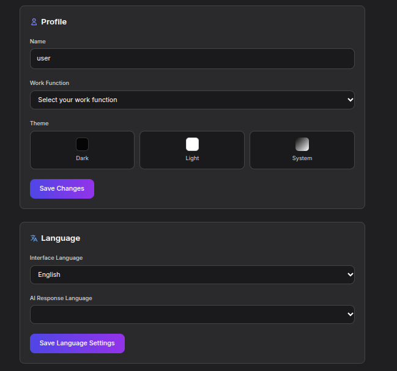

# Propeller AI Chatbot

Propeller AI is a modern chatbot with secure login, persistent chat history, and DeepSeek API integration. Features include Dark/Light themes, dual AI modes (Deep Thinking & Study & Learn), file uploads, chat management, and customizable profiles.



## Features

- **Authentication System**: Secure login/signup with user management
- **AI Modes**: Deep Thinking & Study & Learn specialized modes
- **Chat Management**: Persistent history, rename/delete chats
- **File Support**: Upload images, PDFs, documents (10MB limit)
- **Customization**: Themes, profiles, multiple AI models
- **Modern UI**: Dark mode, smooth animations, responsive design



## Tech Stack       

- **Frontend**: HTML, JavaScript, Tailwind CSS
- **Backend**: Node.js, Express
- **API**: OpenRouter (DeepSeek Chat v3.1)
- **Storage**: LocalStorage



## AI Modes

Propeller AI offers two distinct modes to enhance user experience:

Deep Thinking Mode: Provides in-depth, analytical responses for research, idea generation, and logical reasoning.
Study & Learn Mode: Focused on clear explanations and educational support for students and learners.




## Settings Interface

The settings interface allows users to switch between light and dark themes, manage their profile, and choose from multiple AI models. Preferences are saved for a consistent and personalized experience every time.


## Installation

1. Clone the repository:
```bash
mkdir 'propellerai'
cd 'propellerai'
git clone https://github.com/yourusername/propeller-ai-v1.git
node server.js
